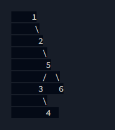

# PreOrderTraversal
Prints the tree's preorder traversal as a single line of space-separated values.

**Input:**
Input is specified as `noOfNodes` `nodes`...
e.g. `6` `1 2 5 3 6 4` would represent a tree of 6 nodes, and the
sequence of those nodes. The tree would look like below:

and the expected output would be: `1 2 5 3 4 6`